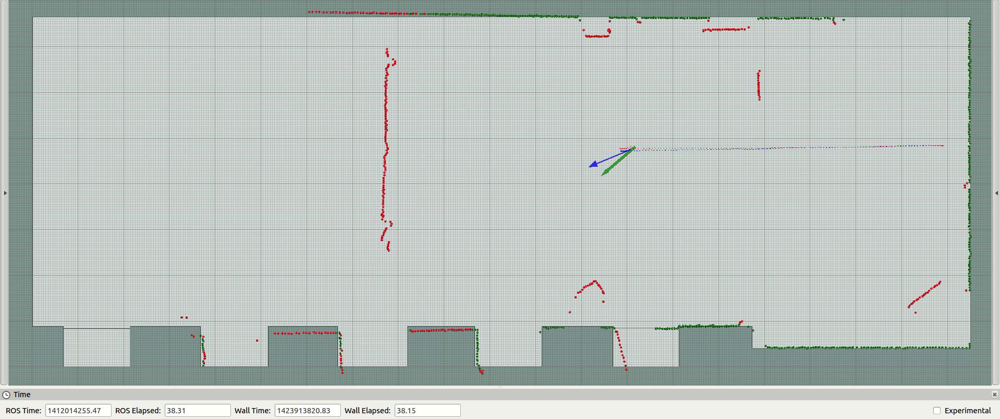

laserscan_to_pointcloud
=======================

ROS package able to assemble sensor_msgs::LaserScan and publish [sensor_msgs::PointCloud2](http://docs.ros.org/api/sensor_msgs/html/msg/PointCloud2.html) using spherical linear interpolation (interpolation optional and number of TFs to use customizable).

It can publish point clouds after a given number of laser scans has been assemble or at regular intervals (these parameters can be changed dynamically through dynamic_reconfigure or by analyzing [nav_msgs::Odometry](http://docs.ros.org/api/nav_msgs/html/msg/Odometry.html) | [sensor_msgs::Imu](http://docs.ros.org/api/sensor_msgs/html/msg/Imu.html) | [geometry_msgs::Twist](http://docs.ros.org/api/geometry_msgs/html/msg/Twist.html)).

The lasers are merged in a given TF frame and the assembler can use an auxiliary frame as recovery (allows to assemble frames in the map frame and when this frame becomes unavailable, it uses the laser->odom TF and the last odom->map TF).




```
Figure 1.1: Example 1 of laser deformation
```


```
Figure 1.2: Example 1 of laser deformation corrected using spherical linear interpolation
```


```
Figure 2.1: Example 2 of laser deformation
```


```
Figure 2.2: Example 2 of laser deformation corrected using spherical linear interpolation
```
